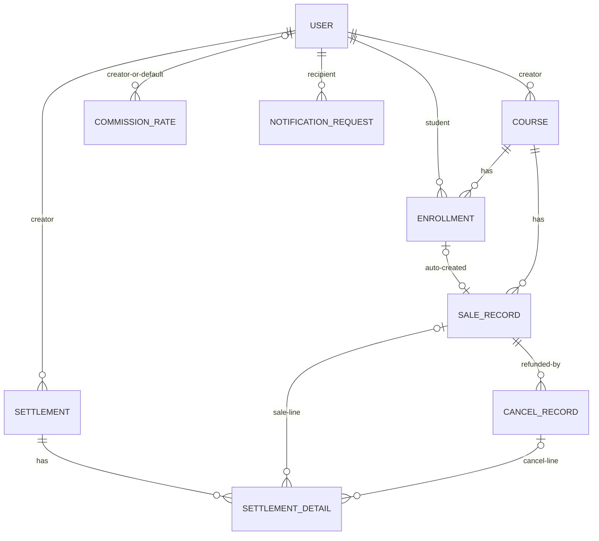

# LiveKlass 백엔드 채용 과제

## 프로젝트 개요

퓨쳐스콜레(LiveKlass) 백엔드 채용 과제 구현물입니다. 공식 요구사항은 **A(수강신청) · B(정산) · C(알림) 중 택1**이지만, 세 과제가 하나의 도메인 이벤트 흐름으로 자연스럽게 이어지는 구조라 **세 과제를 모두 구현**했습니다.

- 결제 확정(A) → 판매 레코드 생성(B)
- 신청 / 확정 / 취소 / 대기열 승격(A) → 알림 발송 요청(C)

선택 구현 항목도 모두 포함했습니다 — 대기열(waitlist), 취소 기한, 수강생 목록·페이지네이션(A) / 정산 확정 상태 관리, 중복 정산 방지, 수수료율 변경 이력(B) / 발송 실패 수동 재시도(C).

문서 체계와 정책 결정 근거는 [`docs/README.md`](docs/README.md)(문서 인덱스)와 [`docs/requirements.md`](docs/requirements.md)(SSOT)에 있습니다. 이 README는 제출용 요약본입니다.

## 기술 스택

| 구분 | 선택 | 비고 |
|---|---|---|
| 프레임워크 | Spring Boot 3.5.16 / Java 21 | Spring MVC + Data JPA + Security + Batch |
| 빌드 | Gradle (`.sdkmanrc`로 Java 버전 고정) | |
| DB | MariaDB 10.11 LTS | `FOR UPDATE SKIP LOCKED`(10.6+) 사용, 대기열 순번도 인덱스 쿼리로 DB에서 직접 계산 |
| 비동기 처리 | `@Scheduled` + Spring Batch (DB 폴링) | 브로커 없이 구현, 실브로커(SQS 등) 전환 가능 구조 |
| 인증 | Spring Security HTTP Basic | role(ADMIN/CREATOR/STUDENT) 인가, 인증 실패 응답도 공통 에러 규격 |
| 문서/테스트 | springdoc-openapi(Swagger), JUnit5 + Testcontainers | 테스트는 전부 실제 MariaDB 대상 통합 테스트 |

공통 결정: 전 구간 **KST 고정**(JVM · DB 세션 · Jackson 직렬화), PK는 **varchar** — 샘플 데이터 id(`creator-1`, `sale-1` 등)를 그대로 시드하기 위한 결정입니다.

## 실행 방법

요구 사항: **Docker**(MariaDB 10.11 컨테이너), **Java 21**(`.sdkmanrc` 포함 — `sdk env` 사용 가능)

스키마 적용(`ddl-auto`)과 샘플 데이터 시드는 **앱 기동 시 자동으로 실행되지 않습니다** — 매 기동마다 재시딩되며 발생하던 정원 초과 예외를 막기 위해, 명시적인 `make` 타깃으로만 트리거합니다.

```bash
make up        # MariaDB 기동 (docker compose up -d, 호스트 포트 13306)
make migrate   # 스키마 반영 (ddl-auto=update로 1회 기동 후 자동 종료) — 최초 1회, 이후 엔티티 변경 시에만
make seed      # migrate + 샘플 데이터 시드(멱등) 후 서버로 계속 기동 — 최초 1회, 또는 데이터 초기화 후
make run       # 서버 기동만(마이그레이션·시드 없음) — 평소 개발 시 반복 실행
```

`docker compose up -d` / `./gradlew bootRun --args='--spring.profiles.active=local ...'`로 직접 실행할 수도 있습니다(각 타깃이 내부적으로 호출하는 명령은 `Makefile` 참고). `make run`은 `--liveklass.seed.enabled`, `--spring.jpa.hibernate.ddl-auto` 인자를 넘기지 않으므로 시드도 스키마 변경도 하지 않습니다.

- Swagger UI: **http://localhost:8080/swagger-ui.html** → 우측 상단 `Authorize`에 계정 입력(HTTP Basic)
- 데이터 초기화: `docker compose down -v && make up && make seed` — 볼륨을 지우고 스키마·시드를 처음부터 다시 만듭니다(스키마는 더 이상 앱 기동 시 자동 초기화되지 않으므로 `make migrate`/`make seed`가 반드시 필요합니다)
- 엔티티(컬럼/인덱스 등) 변경 후에는 `make migrate`로 스키마를 반영한 뒤 `make run`하세요

### 시드 계정 (비밀번호 규칙: `{id}!`)

| 계정 | 이메일 / 비밀번호 | 역할 |
|---|---|---|
| admin-1 | admin-1@liveklass.local / `admin-1!` | 운영자 |
| creator-1 ~ creator-10 | creator-1@liveklass.local / `creator-1!` | 크리에이터 |
| student-1 ~ student-20 | student-1@liveklass.local / `student-1!` | 수강생 |

### 대기열·정원 시연용 시드 강의

과제 원문의 "추가 데이터 가이드"에 따라, 대기열(waitlist)과 "신청은 정원을 점유하지 않는다"(A-1)는 정책을 앱 기동 즉시 확인할 수 있도록 신청 데이터를 미리 채운 강의 2개를 포함했습니다.

| 강의 | 정원 | 신청 현황 | 확인 포인트 |
|---|---|---|---|
| course-4 | 10 | 15명 신청 → 확정 10 + 대기 5 | 정원 도달로 자동 CLOSED(A-5), `GET /api/enrollments/{id}/waitlist-position`으로 대기 순번(1~5) 확인 |
| course-5 | 10 | 12명 신청 → 확정 6 + PENDING 6 | 신청(PENDING)은 정원 미점유 — 정원 초과 신청도 항상 허용되고, 상태는 계속 OPEN |

## API 목록 및 예시

전체 스펙은 Swagger UI(`/swagger-ui.html`) 또는 `/v3/api-docs.yaml`(정적 OpenAPI 덤프) 참고. 아래는 주요 엔드포인트 목록입니다. 인증은 전부 HTTP Basic이며, 표기 없는 한 로그인한 사용자 본인 기준입니다.

### 수강신청(A)

| Method | Path | 설명 | 권한 |
|---|---|---|---|
| POST | `/api/courses` | 강의 등록(DRAFT) | CREATOR |
| GET | `/api/courses` | 강의 목록(상태 필터) | 전체 |
| GET | `/api/courses/{courseId}` | 강의 상세(현재 신청 인원 포함) | 전체 |
| PUT | `/api/courses/{courseId}` | 강의 수정 | 본인 CREATOR / ADMIN |
| POST | `/api/courses/{courseId}/status` | 강의 상태 변경(OPEN/CLOSED/재오픈) | ADMIN |
| GET | `/api/courses/{courseId}/enrollments` | 강의 수강생 목록 | 본인 CREATOR / ADMIN |
| POST | `/api/courses/{courseId}/enrollments` | 수강 신청(만석 시 대기열 편입) | STUDENT |
| GET | `/api/enrollments/me` | 내 수강신청 목록 | STUDENT |
| GET | `/api/enrollments/{enrollmentId}` | 신청 상세 조회 | 본인 / ADMIN |
| POST | `/api/enrollments/{enrollmentId}/confirm` | 결제 확정 | 본인 STUDENT |
| POST | `/api/enrollments/{enrollmentId}/cancel` | 수강 신청 취소 | 본인 STUDENT |
| GET | `/api/enrollments/{enrollmentId}/waitlist-position` | 대기 순번 조회 | 본인 / ADMIN |

### 정산(B)

| Method | Path | 설명 | 권한 |
|---|---|---|---|
| POST | `/api/admin/sales` | 판매 내역 등록 | ADMIN |
| GET | `/api/admin/sales` | 판매 목록(전체, 기간 필터) | ADMIN |
| GET | `/api/admin/sales/{saleRecordId}` | 판매 상세 | ADMIN |
| POST | `/api/admin/sales/{saleRecordId}/cancels` | 취소(환불) 내역 등록 | ADMIN |
| GET | `/api/admin/sales/{saleRecordId}/cancels` | 판매 건의 취소/환불 이력 | ADMIN |
| GET | `/api/sales/my` | 내 강의 판매 목록 | CREATOR |
| GET | `/api/sales/my/cancels` | 내 강의 환불(취소) 목록 | CREATOR |
| GET | `/api/settlements/monthly` | 크리에이터 월별 정산(실시간 집계) | 본인 CREATOR / ADMIN |
| GET | `/api/settlements/my` | 내 정산 확정 이력 | CREATOR |
| GET | `/api/settlements/{settlementId}` | 정산 상세(SALE/CANCEL 라인) | 본인 / ADMIN |
| POST | `/api/admin/settlements` | 정산 확정(생성) | ADMIN |
| POST | `/api/admin/settlements/{settlementId}/status` | 정산 상태 변경(CONFIRMED→PAID) | ADMIN |
| GET | `/api/admin/settlements/aggregate` | 기간 내 크리에이터별 정산 집계 | ADMIN |
| GET | `/api/admin/commission-rates` | 수수료율 목록 | ADMIN |
| POST | `/api/admin/commission-rates` | 수수료율 등록(개별은 기간 겹침 거부, 전체 기본은 겹치는 이전 요율 자동 마감 후 교체) | ADMIN |

### 알림(C)

| Method | Path | 설명 | 권한 |
|---|---|---|---|
| POST | `/api/notifications` | 알림 발송 요청(접수만, 202 성격) | 인증 사용자 |
| GET | `/api/notifications/{notificationId}` | 알림 상태 조회 | 본인 / ADMIN |
| GET | `/api/notifications/me` | 내 알림 목록(읽음 필터) | 인증 사용자 |
| POST | `/api/notifications/{notificationId}/read` | 읽음 처리(멱등) | 본인 |
| GET | `/api/admin/notifications` | 알림센터 목록(상태 필터) | ADMIN |
| POST | `/api/admin/notifications/{notificationId}/retry` | 수동 재시도(DEAD 대상, retry_count 초기화) | ADMIN |

### 요청/응답 예시

**수강 신청 → 결제 확정**

```bash
curl -u student-1:student-1! -X POST http://localhost:8080/api/courses/course-1/enrollments
# 201 Created
{ "id": "...", "courseId": "course-1", "studentId": "student-1", "status": "PENDING", "appliedAt": "..." }

curl -u student-1:student-1! -X POST http://localhost:8080/api/enrollments/{enrollmentId}/confirm
# 200 OK — status: CONFIRMED, confirmedAt 채워짐. 결제 확정 시 SALE_RECORD·알림 요청 자동 생성
```

**알림 발송 요청** (`NotificationCreateRequest`)

```bash
curl -u admin-1:admin-1! -X POST http://localhost:8080/api/notifications \
  -H "Content-Type: application/json" \
  -d '{
    "recipientId": "student-1",
    "type": "GENERAL",
    "channel": "IN_APP",
    "eventId": "manual-notice-1",
    "referenceId": "course-1"
  }'
# 200 OK — 동일 (eventId, recipientId, channel) 재요청 시 새로 만들지 않고 기존 요청 그대로 반환
```

**크리에이터 월별 정산 조회**

```bash
curl -u creator-1:creator-1! "http://localhost:8080/api/settlements/monthly?creatorId=creator-1&month=2025-03"
# 200 OK
{
  "creatorId": "creator-1", "month": "2025-03",
  "totalSalesAmount": 260000, "refundAmount": 110000,
  "netSalesAmount": 150000, "commissionAmount": 30000, "payoutAmount": 120000,
  "salesCount": 4, "cancelCount": 2
}
```

**공통 에러 응답 규격** (`ErrorResponse`, Security 인증/인가 실패도 동일)

```json
{ "code": "COURSE_CAPACITY_EXCEEDED", "message": "정원이 초과되었습니다.", "errors": [] }
```

전체 에러 코드는 `com.liveklass.common.error.ErrorCode` 참고.

## 데이터 모델 설명

상세 ERD·제약조건은 [`docs/erd.md`](docs/erd.md).



핵심 테이블:

- **COURSE**: `capacity`(정원) / `confirmed_count`(확정 인원, 역정규화 카운터). 정원 검증·증감은 결제 확정·취소 시 `SELECT ... FOR UPDATE`로 X-lock을 잡고 처리.
- **ENROLLMENT**: `status`(PENDING/CONFIRMED/CANCELLED/WAITLISTED) + `active_flag`(STORED generated column) → `UNIQUE(course_id, student_id, active_flag)`로 활성 신청 중복만 차단하고 이력은 보존. 대기열 순번은 `applied_at` 기준, `INDEX(course_id, status, applied_at)`로 직접 계산(캐시 없음).
- **SALE_RECORD / CANCEL_RECORD**: 판매 시점 수수료율을 `commission_rate` 컬럼에 스냅샷. 취소는 원 판매를 참조하며 누적 환불액이 원 결제액을 넘지 않도록 앱 레벨로 검증.
- **COMMISSION_RATE**: `creator_id`가 null이면 전체 기본 요율. 개별 크리에이터 요율은 기간 겹침 등록을 거부하고, 전체 기본 요율은 겹치는 이전 요율을 신규 시작일 전날로 자동 마감한 뒤 교체(B-3c). 요율 적용은 판매(결제 확정) 시점 기준이며, 요율 적용 기간 자체에 월 단위 제약은 없다 — 월 단위는 정산 집계 주기일 뿐이다.
- **SETTLEMENT / SETTLEMENT_DETAIL**: 정산 상세는 SALE(+)/CANCEL(−) 라인을 모두 보존해 상세 합계가 총액을 그대로 재현(감사 가능) — 월 경계 취소로 인한 음수 정산도 근거가 남는다.
- **NOTIFICATION_REQUEST**: `status`(PENDING/PROCESSING/SENT/RETRY_WAIT/DEAD), `UNIQUE(event_id, recipient_id, channel)`로 중복 요청 차단, `INDEX(status, next_retry_at)`로 폴링 클레임.

## 요구사항 해석 및 가정

- **대기열(waitlist)** — "강의별 정원 대기(취소표 대기)"로 해석했습니다: 만석 시 순번 등록, 취소 발생 시 순번대로 승격. 접속 폭주 제어용 대기실(waiting room)은 별개 인프라 레이어로 판단해 범위 밖으로 뒀습니다.
- **만석 자동 마감 vs 대기열 편입 충돌** — 만석 시 자동 CLOSED로 하면 "신청은 OPEN만" 규칙과 대기열 진입이 충돌합니다. **CLOSED라도 만석이면 대기열 편입을 허용**하고, 여석 있는 수동 CLOSED·DRAFT만 신청을 거부하는 것으로 해소했습니다. 자동 CLOSED 전환은 **결제 확정 시점에만** 일어나므로(정원 점유 자체가 결제 확정 시점, A-1), OPEN인 동안에는 신청(PENDING) 자체가 정원과 무관하게 항상 허용됩니다 — 정원보다 많은 PENDING이 쌓여도 정상이며, 정원 초과 여부는 오직 결제 확정 시점에 `COURSE_CAPACITY_EXCEEDED`로만 판정합니다(시연: course-5).
- **"중복 발송 금지"와 at-least-once** — 고착 복구 시점에는 직전 발송의 성공 여부를 알 수 없으므로(발송 후 기록 전 다운) 전달 의미론은 **at-least-once**가 한계입니다. exactly-once는 발송 채널의 멱등성 없이는 불가능하므로, "중복 발송 금지"는 **동일 이벤트의 중복 '요청' 차단**(멱등키 UNIQUE 제약)으로 해석했습니다.
- **알림 실패가 비즈니스에 영향 금지 + 예외 무시 금지** — 적재는 비즈니스 트랜잭션에 참여(원자적)하고, 발송 실패는 비즈니스와 무관한 잡에서 발생하며 무시가 아니라 **상태(RETRY_WAIT/DEAD)와 실패 사유로 기록**되어 재시도됩니다.
- **수동 재시도의 카운트 초기화** (과제가 명시적으로 묻는 항목) — **초기화**로 정책화했습니다. 운영자의 수동 개입은 장애 원인 해소 후의 "새 시도"이며, 초기화하지 않으면 1회 실패로 즉시 DEAD가 되어 수동 재시도가 무의미해집니다.
- **여러 기기의 동시 읽음 처리** — `is_read = true`는 단방향 멱등 연산이라 순서와 무관하게 동일 상태로 수렴하므로 락 없이 처리했습니다.
- **수수료율 적용과 정산 집계 주기는 별개** — 수수료율은 결제 확정일 기준 레코드 단위로 적용되고(started_at/ended_at 범위), 정산은 그 결과를 월 단위로 집계할 뿐입니다. 따라서 월 중간에 요율이 바뀌어도 계산이 불가능해지는 상황은 없습니다 — 각 판매 레코드는 자기 판매 시점의 요율을 스냅샷으로 갖고, 월별 정산은 해당 월에 속한 레코드들의 스냅샷 값을 그대로 합산합니다.
- **월 경계 취소의 음수 정산은 의도된 동작** — "취소만 있는 월"의 정산이 음수가 될 수 있는데, 차감 근거를 보존하기 위해 그대로 음수로 응답합니다. 이월 상계·미수금 처리는 과제 범위를 넘어서는 별도 운영 정책으로 보고 의도적으로 제외했습니다.
- **샘플 데이터 확장** — 과제 원문의 샘플 데이터는 제시된 시나리오 일부만 다루는 데이터이며, 검증 시나리오 확장을 위해 크리에이터·수강생·강의·신청 데이터를 추가하는 것은 원문의 "추가 데이터 가이드" 취지에 맞다고 판단해 자유롭게 확장했습니다(시드 규모는 위 실행 방법 참고).

## 설계 결정과 이유

모든 정책 결정은 항목 ID(G-\*/A-\*/B-\*/C-\*)로 [`docs/requirements.md`](docs/requirements.md)에 근거와 함께 기록했습니다. 코드 주석·테스트가 이 ID를 참조합니다.

| ID | 결정 | 근거 |
|---|---|---|
| A-1 | 정원 점유는 **결제 확정 시점**. 신청(PENDING)은 무락 | "결제가 완료되어야 수강 확정" — 마지막 자리 경합은 확정 API에서 course 행 X-lock으로 해소 |
| A-2a | 활성 신청 중복은 **generated column + UNIQUE** | MariaDB partial index 부재 우회. 동시 중복 신청의 최종 방어선을 DB 제약으로 |
| A-6 | 대기열 SOT는 DB, 순번 조회는 인덱스 쿼리(캐시 없음) | 취소 시 1순위 자동 승격 + 24h 결제 기한, 만료 시 잡이 다음 순번 승격 |
| B-3/B-3a | 수수료율은 **결제 확정일 기준 레코드 단위 스냅샷**, 계산은 HALF_UP | 요율 적용 기간에 월 단위 제약은 없음(월 단위는 정산 집계 주기일 뿐) — 레코드 단위 합산이라 요율 변경 이력과 자연히 양립 |
| B-3c | 전체 기본 요율 재등록은 겹침 거부 대신 **이전 요율을 자동 마감 후 교체**, 개별 크리에이터 요율은 겹침 거부 유지 | 플랫폼 기본값 갱신은 "지금부터 새 요율로 교체"가 자연스러운 운영 시나리오 — 개별 요율 변경은 신중한 명시적 조작으로 간주 |
| B-6 | 정산 상세는 판매(+)/환불(−) 라인 모두 보존 | 상세 합계 = 순판매 재현(감사), 월 경계 취소의 차감 근거 보존 — 월 정산 음수 허용(이월 상계는 범위 밖) |
| C-1 | **DB 적재(outbox) + 폴링 발송**(`@Scheduled` + Spring Batch) | 적재가 비즈니스 트랜잭션에 참여해 유실 창 없음. 발송부는 `NotificationSender` 인터페이스 — SQS 전환 지점 |
| C-4 | PROCESSING 고착 복구, 타임아웃(3분) < 재시도 간격(5분) | 복구로 되돌아온 건이 다음 재시도 폴링과 겹치지 않게 |
| C-5 | 다중 인스턴스 클레임은 `FOR UPDATE SKIP LOCKED` | 두 워커가 같은 알림을 잡을 수 없음 — 동시성 통합 테스트로 증명 |
| C-6 | 중복 발송 방지 키 = `(event_id, recipient_id, channel)` UNIQUE | 동일 키 재요청은 에러가 아니라 기존 요청 반환(멱등) |

**과제 C 필수 제출물** — 비동기 처리 구조·상태 모델·재시도 정책·운영 시나리오(고착 복구/재시작/다중 인스턴스)·실브로커 전환 방안: **[`docs/async-design.md`](docs/async-design.md)**

## 테스트 실행 방법

```bash
./gradlew test   # Docker 필요 — Testcontainers가 테스트용 MariaDB를 별도로 기동
```

`make test`로도 동일하게 실행할 수 있습니다. `make up`으로 띄운 로컬 MariaDB와는 무관하게 Testcontainers가 별도 컨테이너를 띄우므로 `make up` 여부와 상관없이 동작합니다.

- 통합 테스트 **73개**(JUnit5), 전부 실제 MariaDB(Testcontainers) 대상 — Mock DB 없음
- 클린 체크아웃 기준 `docker compose up` → 앱 기동 → E2E(강의 개설 → 신청 → 확정 → 판매 → 알림 → 취소 → 환불 → 대기열 승격 → 월별 정산) 실기동 재현 확인 완료

### 추가 검증 케이스와 추가 이유 (샘플 데이터 밖)

과제 원문의 "추가 데이터 가이드"에 따라, 중요하다고 판단한 시나리오를 직접 데이터로 등록·테스트했습니다.

| 케이스 | 추가 이유 | 테스트 |
|---|---|---|
| 잔여 1석에 10스레드 동시 결제 확정 | 과제 A의 핵심 요구 "마지막 자리 동시 신청" — 정확히 1명 확정·나머지 409·자동 마감까지 검증 | `EnrollmentConcurrencyTest` |
| 동일 사용자 5스레드 동시 신청 | 사전 조회만으로는 못 막는 동시 중복 — UNIQUE 제약이 막는지 | `EnrollmentConcurrencyTest` |
| 승격 후 24h 미결제 → 자동 취소·다음 순번 승격 | 대기열 승격이 "자리 무한 점유"가 되지 않는지(Clock 조작으로 재현) | `WaitlistFlowTest` |
| 취소 기한(7일) 경과 후 취소 시도 | 과제 예시 정책의 경계 검증 | `EnrollmentFlowTest` |
| 부분 환불 다회 누적, 원금 초과 거부, 잔여 정확히 소진 | 환불 누적 한도의 경계값 — 동시 환불은 판매 행 X-lock 직렬화 | `SaleCommissionRuleTest` |
| 요율 변경 전후 판매의 수수료 차이(20%↔10%) | 스냅샷이 과거 정산을 보존하는지(가산점 항목의 실검증) | `SaleCommissionRuleTest` |
| 월 경계: 1월 판매 +48,000 / 2월 취소 −48,000 | 취소만 있는 월의 **음수 정산** 허용 검증 | `SettlementAcceptanceTest` |
| 잘못된 연월 형식 400 / **미래 연월은 0원 정상 응답** | 원문 "추가 데이터 가이드"가 예시한 케이스 — 조회 API 의미론 유지 | `SettlementAcceptanceTest` |
| 같은 멱등키 5스레드 동시 알림 접수 → 1건 생성·전원 동일 응답 | 과제 C "동시에 같은 요청" — 에러가 아닌 멱등 수렴인지 | `NotificationConcurrencyTest` |
| 2개 워커 동시 폴링 → 클레임 교집합 0·무유실 | 다중 인스턴스 요구를 실제 경합으로 증명 | `NotificationConcurrencyTest` |
| 실패 → 5분 후 재시도 → 3회 도달 DEAD → 수동 재시도(카운트 초기화) | 재시도 정책 전체 수명주기(실패 주입 Sender) | `NotificationRetryFlowTest` |
| PROCESSING 고착 3분 경과 회수, **반복 고착도 임계 도달 시 DEAD** | 복구가 무한 재시도 루프가 되지 않는지 | `NotificationRecoveryTest` |
| 재기동 시나리오: 잔존 PENDING/RETRY_WAIT를 다음 폴링이 처리 | "서버 재시작 유실 없음" 요구의 직접 검증 | `NotificationRetryFlowTest` |
| 미인증 401 · 권한 부족 403도 공통 에러 규격 | Security 실패 응답이 규격을 깨지 않는지 | `SecurityErrorFormatTest` |
| 정원 10에 신청 15명(확정 10 + 대기 5) 시드 | 대기열 상태를 앱 기동 즉시 확인 가능하게(정원 도달 자동 CLOSED 포함) | `SeedDataImporterTest` |
| 정원 10에 신청 12명, 확정은 6명만(정원 미달) 시드 | 신청(PENDING)은 정원을 점유하지 않음을 데이터로 시연 | `SeedDataImporterTest` |
| 전체 기본 요율 재등록 시 이전 요율 자동 마감 | 겹침 거부 대신 자동 교체 정책 검증(개별 크리에이터는 여전히 거부) | `CommissionRateServiceTest` |

## 미구현 / 제약사항

- 인증은 HTTP Basic(과제 시연 최적화) — JWT 전환 여지. 스키마는 `ddl-auto`(과제 규모 고려) — 운영 전환 시 Flyway
- 발송 예약(특정 시각), 타입별 템플릿(선택 미구현)은 확장 지점만 설계에 반영: 예약은 클레임 조건의 "기한 도래"와 동일 패턴으로 자연 확장 가능
- 정산 확정은 생성 시점 스냅샷 — 확정 후 소급 취소는 다음 정산에서 조정하는 운영 정책이 필요(범위 밖)
- 이메일 실발송·실메시지 브로커는 과제 제약대로 미구현(Mock/로그 대체, 브로커 없이 전환 가능한 구조로만 설계)

## AI 활용 범위

이 과제는 Claude Code(Anthropic)를 코딩 에이전트로 적극 활용해 진행했으며, 반복적인 대화형 협업 방식으로 작업했습니다.

**진행 방식**: 제 초안 제시 → LLM(Claude)의 피드백 → 제 초안을 부분 수정 → LLM의 피드백 → … (요구사항 해석·설계 방향이 수렴할 때까지 반복) → LLM이 코드로 구현 → 제가 구현 결과를 검토하고 수정을 요청 → … (테스트 통과와 실동작 확인까지 반복)

- 정책 결정(`docs/requirements.md`의 각 항목)은 이 왕복 과정을 거쳐 확정했습니다 — 제가 먼저 방향을 제시하면 LLM이 대안·엣지 케이스·기존 코드와의 정합성을 짚어주고, 그 피드백을 반영해 다시 초안을 다듬는 식입니다.
- 도메인 코드·테스트 코드의 실제 구현은 LLM이 담당했고, 저는 구현 결과를 리뷰해 채택 여부를 결정하거나 수정을 요청했습니다.
- 검증은 매 단계 `./gradlew test` 통과와 Swagger UI 실기동 확인을 기준으로 삼았습니다.
- 최종 요구사항 해석, 정책 확정, 커밋 범위는 모두 제가 판단했습니다.
