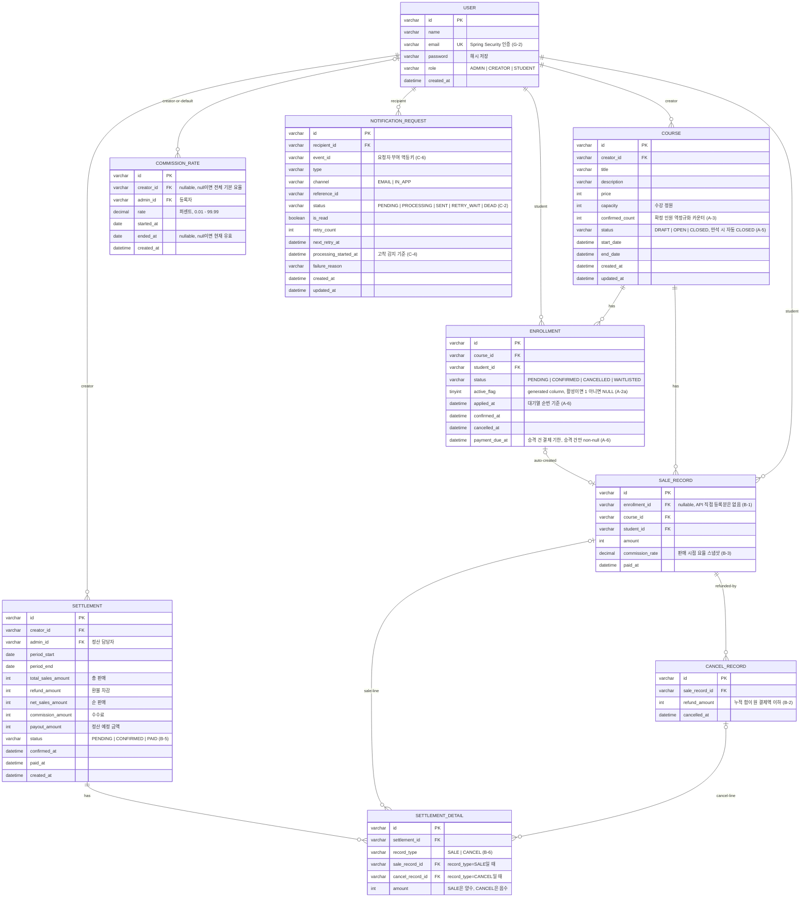

# ERD

[requirements.md](requirements.md) 결정 반영본. 전 구간 KST(G-3), PK는 varchar(G-4, 샘플 데이터 호환).

## 제약·인덱스 (다이어그램으로 표현 못 하는 것)

| 테이블 | 제약/인덱스 | 근거 |
|---|---|---|
| ENROLLMENT | `UNIQUE(course_id, student_id, active_flag)` — active_flag는 STORED generated column `IF(status IN ('PENDING','CONFIRMED','WAITLISTED'), 1, NULL)` | A-2a 활성 중복 방지 |
| ENROLLMENT | `INDEX(course_id, status, applied_at)` — 대기열 순번·승격 조회 | A-6 |
| NOTIFICATION_REQUEST | `UNIQUE(event_id, recipient_id, channel)` | C-6 중복 발송 방지 |
| NOTIFICATION_REQUEST | `INDEX(status, next_retry_at)` — 폴링 클레임 | C-5 |
| SALE_RECORD | `INDEX(course_id, paid_at)` — 정산 집계(creator는 course 경유) | B 집계 |
| CANCEL_RECORD | `INDEX(cancelled_at)` — 취소 월 기준 집계 | B 집계 |
| COMMISSION_RATE | 개별 크리에이터는 동일 대상 기간 겹침 등록 거부. 전체 기본 요율(creatorId null)은 거부 대신 겹치는 이전 요율을 자동 마감 후 교체 — 앱 검증 | B-3c |
| SETTLEMENT | 동일 creator 기간 겹침 금지 — 확정 생성 시 앱 검증 | B-5 |
| CANCEL_RECORD | 누적 refund_amount ≤ 원 SALE_RECORD.amount — 앱 검증 | B-2 |

## 애플리케이션 규칙 메모

- `COURSE.confirmed_count` 증감은 course 행 X-lock(`SELECT ... FOR UPDATE`) 트랜잭션 안에서만 수행 — 락의 필수 지점은 결제 확정·취소 (A-1/A-3)
- 대기열 순번의 SOT는 DB(ENROLLMENT WAITLISTED + applied_at). 순번 조회는 `INDEX(course_id, status, applied_at)` 기반 쿼리로 직접 계산하며, 별도 캐시 레이어는 두지 않는다 (A-6)
- 알림 클레임은 `FOR UPDATE SKIP LOCKED` — MariaDB 10.6+ 필요, docker 이미지 10.11 LTS 권장 (C-5)
- 재시도 임계·간격·처리 타임아웃은 `@ConfigurationProperties`로 외부화 (C-3/C-4)
