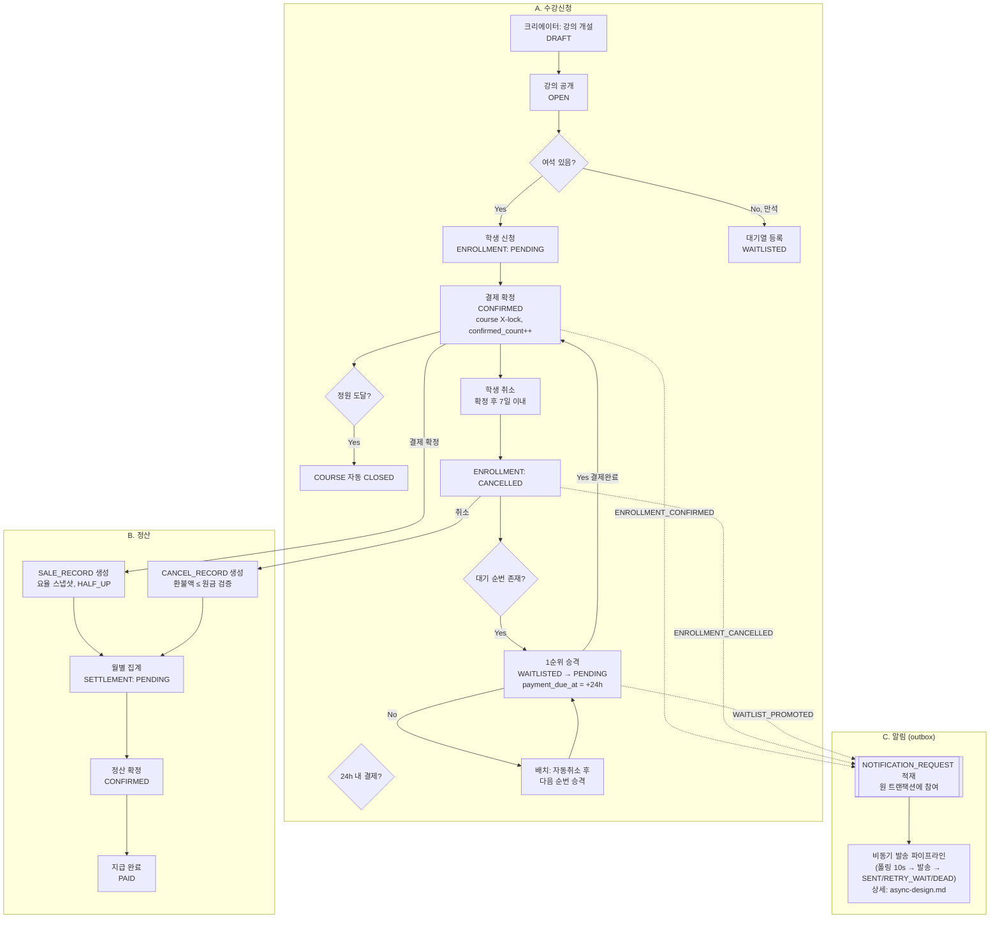

# 전체 기능 플로우 (A → B → C 연결)

A(수강신청)·B(정산)·C(알림)는 별도 기능이 아니라 하나의 이벤트 흐름이다: **결제 확정이 판매(B)를 만들고, 신청·확정·취소·대기열 승격이 알림(C)을 만든다.** 이 문서는 그 연결만 보여준다. 각 도메인 내부 상세는 다음을 참조:

- 테이블 구조: [erd.md](erd.md)
- 알림 상태 모델·재시도 정책: [async-design.md](async-design.md)
- 정책 근거(항목 ID): [requirements.md](requirements.md)

## 읽는 법

- **실선(→)**: 도메인 간 데이터 생성 (신청 도메인이 판매 레코드를 만듦)
- **점선(-.→)**: 이벤트 발행 → 알림 요청 적재 (동일 트랜잭션, 원자적)
- 다이어그램의 각 상태 이름(`PENDING`, `CONFIRMED` 등)은 도메인마다 별도 컬럼(`ENROLLMENT.status`, `SETTLEMENT.status`, `NOTIFICATION_REQUEST.status`)이며 서로 다른 값 집합이다 — 혼동 방지용으로 각 노드에 소속 컬럼을 명시했다
